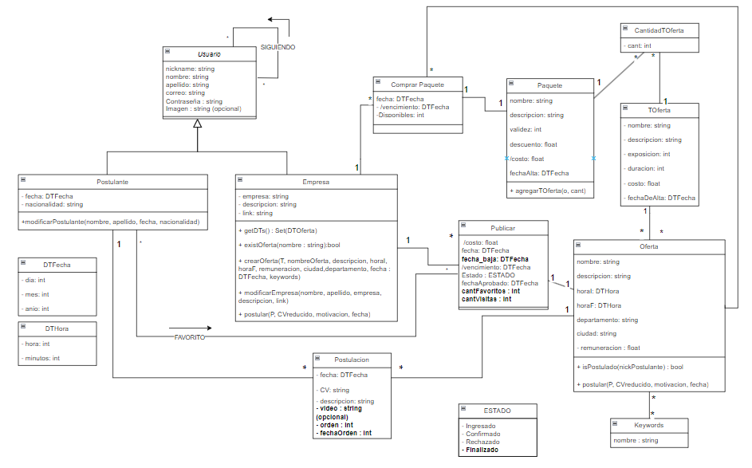

# Proyecto Taller de Programación - Portal de Búsqueda de Empleo

## Introducción
Este proyecto, realizado durante el segundo semestre de 2023, fue un esfuerzo colaborativo para crear un portal de búsqueda de empleo con funcionalidades avanzadas. A través de tres tareas iterativas, desarrollamos una solución full-stack que integra una aplicación web y un sistema de gestión de ofertas laborales.

## Tarea 1: Gestión de Ofertas Laborales
### Objetivos
- Aprender Java y Swing para desarrollo de interfaces gráficas.
- Implementar pruebas con JUnit y herramientas de desarrollo.

### Visión y Actores
- **Visión:** Desarrollar una plataforma para gestión y aplicación a ofertas laborales.
- **Actores:** Administradores y usuarios regulares con capacidades de creación y gestión de ofertas.

### Requerimientos y Herramientas
- **Funcionales:** Gestión de usuarios y ofertas, búsqueda y filtrado.
- **Especiales:** Pruebas con JUnit, diseño GUI con Swing.
- **Tecnologías:** Java, Swing, JUnit, Git.

## Tarea 2: Desarrollo de Aplicación Web
### Objetivos
- Crear una aplicación web con tecnologías cliente-servidor.
- Implementar autenticación y manejo de usuarios.

### Visión y Actores
- **Visión:** Integrar la aplicación web con la estación de trabajo existente.
- **Actores:** Administradores, visitantes y usuarios registrados.

### Requerimientos y Herramientas
- **Funcionales:** Modificaciones al sistema existente, implementación de autenticación.
- **Especiales:** Diseño web, validación cliente, pruebas automáticas.
- **Tecnologías:** HTML5, CSS, JavaScript, JSP, Servlets, Java EE, Tomcat.

## Tarea 3: Mejoras y Nuevas Funcionalidades
### Objetivos
- Implementar Web Services y desarrollar persistencia de datos.
- Desplegar en entornos de producción y aplicar prácticas de desarrollo en equipo.

### Visión y Actores
- **Visión:** Desarrollar un sistema móvil adaptativo e independiente.
- **Actores:** Administradores, visitantes, usuarios registrados.

### Requerimientos y Herramientas
- **Funcionales:** Nuevas funcionalidades en servidor web, desarrollo de aplicación móvil.
- **Especiales:** Interfaz adaptativa, generación de PDF, validación AJAX.
- **Tecnologías:** HTML5, CSS, JavaScript, AJAX, Bootstrap, iText, JSP, Servlets, Java EE, HSQLDB.

## Diagrama de Dominio

## Instalación y Uso

