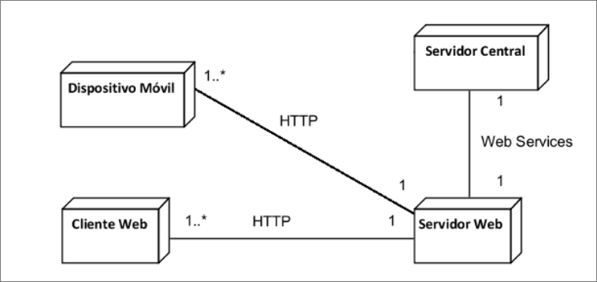

# Proyecto Taller de Programación - Portal de Búsqueda de Empleo

## Introducción
Este proyecto, realizado durante el segundo semestre de 2023, fue un esfuerzo colaborativo para crear un portal de búsqueda de empleo con funcionalidades avanzadas. A través de tres tareas iterativas, desarrollamos una solución full-stack que integra una aplicación web y un sistema de gestión de ofertas laborales.

## Tarea 1: Gestión de Ofertas Laborales
### Objetivos
- Aprender Java y Swing para desarrollo de interfaces gráficas.
- Implementar pruebas con JUnit y herramientas de desarrollo.

### Visión y Actores
- **Visión:** Desarrollar una plataforma para gestión y aplicación a ofertas laborales.
- **Actores:** Administradores y usuarios regulares con capacidades de creación y gestión de ofertas.

### Requerimientos y Herramientas
- **Funcionales:** Gestión de usuarios y ofertas, búsqueda y filtrado.
- **Especiales:** Pruebas con JUnit, diseño GUI con Swing.
- **Tecnologías:** Java, Swing, JUnit, Git.
- 
La letra completa y detallada de esta tarea esta [aqui](https://github.com/FranciszekaMateu/tprog-trabajoUy/blob/main/docs/Tarea1_2023-v1.1.pdf)

## Tarea 2: Desarrollo de Aplicación Web
### Objetivos
- Crear una aplicación web con tecnologías cliente-servidor.
- Implementar autenticación y manejo de usuarios.

### Visión y Actores
- **Visión:** Integrar la aplicación web con la estación de trabajo existente.
- **Actores:** Administradores, visitantes y usuarios registrados.

### Requerimientos y Herramientas
- **Funcionales:** Modificaciones al sistema existente, implementación de autenticación.
- **Especiales:** Diseño web, validación cliente, pruebas automáticas.
- **Tecnologías:** HTML5, CSS, JavaScript, JSP, Servlets, Java EE, Tomcat.
- 
La letra completa y detallada de esta tarea esta [aqui](https://github.com/FranciszekaMateu/tprog-trabajoUy/blob/main/docs/Tarea2_2023_v1.0.pdf)

## Tarea 3: Mejoras y Nuevas Funcionalidades
### Objetivos
- Implementar Web Services y desarrollar persistencia de datos.
- Desplegar en entornos de producción y aplicar prácticas de desarrollo en equipo.

### Visión y Actores
- **Visión:** Desarrollar un sistema móvil adaptativo e independiente.
- **Actores:** Administradores, visitantes, usuarios registrados.

### Requerimientos y Herramientas
- **Funcionales:** Nuevas funcionalidades en servidor web, desarrollo de aplicación móvil.
- **Especiales:** Interfaz adaptativa, generación de PDF, validación AJAX.
- **Tecnologías:** HTML5, CSS, JavaScript, AJAX, Bootstrap, iText, JSP, Servlets, Java EE, HSQLDB.
- 
La letra completa y detallada de esta tarea esta [aqui](https://github.com/FranciszekaMateu/tprog-trabajoUy/blob/main/docs/Tarea3_2023_v1.1.pdf)

## Diagrama de Dominio


## Distribución y arquitectura final


## Instalación y Uso
Crear un README efectivo para tu aplicación en GitHub es una excelente manera de guiar a los usuarios a través del proceso de instalación. Aquí te proporciono un ejemplo de cómo podría estructurarse:

---

# Nombre de Tu Aplicación

Breve descripción de lo que hace tu aplicación.

## Comenzando

Estas instrucciones te proporcionarán una copia del proyecto en funcionamiento en tu máquina local para propósitos de desarrollo y pruebas.

### Prerrequisitos

Lo que necesitas para instalar el software y cómo instalarlos.

```
Ejemplo: Node.js, Python 3.6, etc.
```

### Instalación y uso

Estos son los pasos para hacer correr el servidor frontend y backend.

#### Paso 1: Clonar el repositorio

```
git clone https://github.com/FranciszekaMateu/tprog-trabajoUy.git
```

#### Paso 2: Instalar maven
En ubuntu
```
apt install maven
```
En arch:
```
pacman -S maven
```
#### Paso 3: Dar permisos

```
cd tprog-trabajoUy
cd Tarea3
cd Deploy
```
Ahora le damos permisos a los .sh 
#### Paso 4: Ejecutar la aplicación

```
npm start
```


